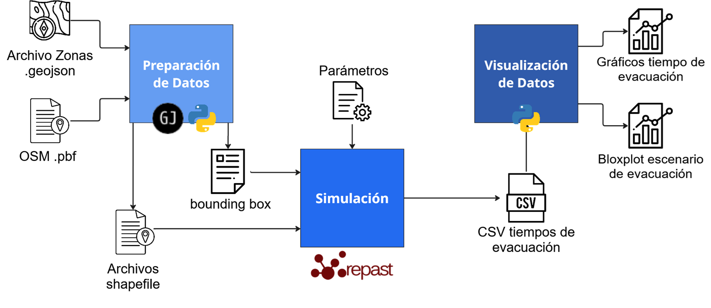

# Simulador basado en agentes de evacuación de personas en entornos urbanos

Simulador de evacuación basado en agentes desarrollado con **Repast Simphony**, utilizando datos geográficos reales para modelar escenarios de evacuación urbana.

El modelo permite simular el movimiento de personas hacia zonas seguras considerando:

- diferentes **velocidades de desplazamiento**
- **tiempos de pre-evacuación**
- **rutas sobre red vial**
- **congestión entre agentes**

Los resultados de la simulación se exportan como archivos **CSV** para su posterior análisis utilizando **Python**.

---

# Descripción del proyecto

Este proyecto implementa un **modelo de simulación basado en agentes (ABM)** para analizar procesos de evacuación en entornos urbanos.

La simulación utiliza datos GIS derivados de **OpenStreetMap** para construir:

- red de calles
- zonas iniciales
- zonas seguras
- límites geográficos del escenario

Los agentes representan individuos que intentan evacuar hacia una zona segura utilizando rutas calculadas mediante **A\***.

El sistema permite experimentar con diferentes configuraciones de agentes para evaluar cómo influyen variables como:

- distribución de velocidades
- cantidad de agentes
- tiempos de reacción en el tiempo total de evacuación.

---

# Arquitectura del sistema

El sistema se compone de tres componentes principales:

### 1. Preparación de datos GIS

Datos geográficos de **OpenStreetMap** (obtenidos desde geojson.io) son procesados para generar:

- red vial
- zonas iniciales
- zonas seguras
- archivos **Shapefile** y **GeoJSON** utilizados por el simulador.

### 2. Simulación de evacuación

Implementada en **Java + Repast Simphony**.

Componentes principales:

- `ContextCreator`  
  Inicializa el entorno del simulador.

- `GisAgent`  
  Representa individuos evacuando.

- `MapCell`  
  Representa las celdas del mapa.

- `ZoneAgent`  
  Representa zonas geográficas del entorno.

### 3. Análisis de resultados

Los resultados generados por el simulador se procesan utilizando **Python** para generar:

- curvas de evacuación
- boxplots de tiempos
- comparaciones entre escenarios

---

## Entradas y salidas

### `map_converter`
Herramientas y scripts utilizados para procesar y convertir datos geográficos desde el formato .geojson al formato requerido por el simulador.

### `Input (/data)`
Contiene los datos geográficos de entrada utilizados por el simulador, incluyendo mapas, zonas iniciales, zonas seguras y archivos GIS en formato **Shapefile**.

### `Outputs (/output)`
Resultados generados por la simulación en formato CSV con métricas de evacuación utilizadas posteriormente para análisis y visualización de datos.

--- 

# Tecnologías utilizadas

- **Java**
- **Repast Simphony**
- **Python**
- **OpenStreetMap**
- **GeoJSON**
- **Shapefile**
- **GIS**

---
# Trabajo académico

Este proyecto fue desarrollado como trabajo de título para obtener el título de ingeniera civil informática.

El objetivo fue explorar el uso de **simulación basada en agentes aplicada a escenarios de evacuación urbana**, integrando datos geográficos reales y herramientas de análisis de datos aplicables a cualquier escenario.
