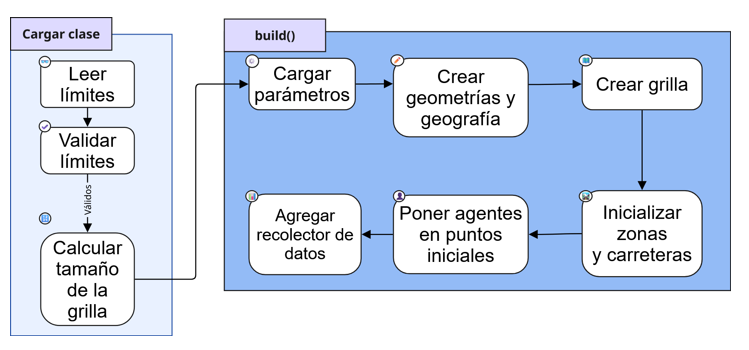
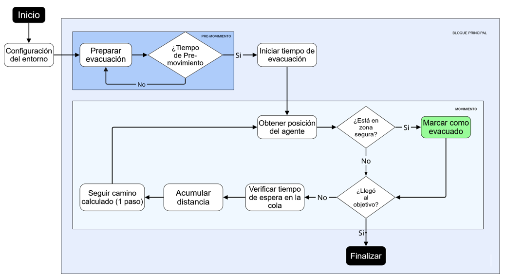

## Código fuente (`src/evacSim/agents`)

Esta carpeta contiene la implementación principal de la simulación de evacuación.  
Aquí se definen los agentes, la representación del mapa y la lógica de movimiento dentro del entorno de simulación.

### `ContextCreator.java`
Clase principal encargada de **inicializar el modelo**.

Funciones principales:

- Cargar los datos del mapa generados a partir de los archivos GIS.
- Crear la grilla de simulación.
- Inicializar las zonas iniciales y zonas seguras.
- Generar los agentes de evacuación (`GisAgent`).
- Configurar la distribución de velocidades de los agentes.
- Registrar métricas globales como número de evacuados.

También define constantes importantes del modelo como:

- tamaño de la grilla
- tamaño de celda en metros
- funciones de conversión entre coordenadas geográficas y grilla.

Diagrama de funcionamiento:

---

### `GisAgent.java`
Clase que implementa los agentes que representan a las personas evacuando.

Cada agente:

- posee una velocidad de desplazamiento (0.5, 1.0 o 1.5 m/s)
- tiene un tiempo de pre-evacuación aleatorio
- busca una zona segura objetivo
- calcula rutas en el mapa usando **A\*** (A-star pathfinding)

Comportamiento principal del agente:

1. Espera su tiempo de pre-evacuación.
2. Calcula una ruta hacia una zona segura.
3. Se mueve celda por celda a lo largo del camino.
4. Evita celdas ocupadas por otros agentes.
5. Recalcula rutas si encuentra congestión.
6. Registra métricas de evacuación cuando llega a destino.

También calcula métricas como:

- tiempo de pre-movimiento
- tiempo de movimiento
- tiempo total de evacuación
- distancia recorrida

Estos datos se almacenan posteriormente para generar los archivos CSV de salida.

Diagrama de funcionamiento:

---

### `ZoneAgent.java`
Representa zonas geográficas dentro del modelo, como áreas de interés o zonas seguras.

En esta implementación se usa principalmente como representación de entidades espaciales dentro del entorno GIS del simulador.

---

### `MapCell.java`
Define los tipos de celdas del mapa y métodos de validación.

Tipos principales:

- `EMPTY`
- `INITIAL_ZONE`
- `SAFE_ZONE`
- `ROAD`
- `ROAD_IN_INITIAL`
- `ROAD_IN_SAFE`

Funciones:

- verificar si una celda es transitable
- verificar si una celda es válida para inicializar agentes
- verificar si una celda pertenece a una zona segura

---

#### `EvacuationData.java`
Se encarga de registrar las métricas de evacuación de cada agente.

Genera los archivos CSV con:

- tiempo de pre-movimiento
- tiempo de movimiento
- tiempo total de evacuación

---

#### `GeoConversionTest.java`
Archivo auxiliar utilizado durante el desarrollo para probar las funciones de conversión entre coordenadas geográficas y coordenadas de la grilla.

---

#### `LegendHandler.java`
Clase utilizada para mostrar una leyenda visual dentro del simulador, indicando el significado de los colores de los agentes y elementos del mapa.
